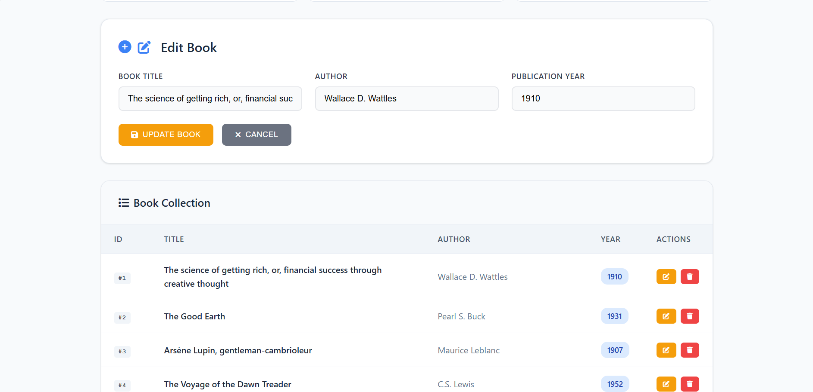

# LearningDotNet

A simple ASP.NET Core Web API project that dynamically fetches a list of books from the Open Library API and allows users to perform CRUD operations on the locally stored collection.

---
## Live Demo :- [Click here](https://learningdotnet.onrender.com) 

---
## Features

- Fetches book data dynamically from the Open Library API on first request.
- Stores the fetched books in a local in-memory collection.
- Supports Create, Read, Update, and Delete (CRUD) operations on the book collection.
- Uses `HttpClientFactory` for external API calls.
- Minimal and clean REST API design.

---

## API Endpoints

| Method | Endpoint         | Description                      |
|--------|------------------|--------------------------------|
| GET    | `/api/books`     | Get all books                   |
| GET    | `/api/books/{id}`| Get a book by ID                |
| POST   | `/api/books`     | Add a new book                  |
| PUT    | `/api/books/{id}`| Update an existing book         |
| DELETE | `/api/books/{id}`| Delete a book                   |

---

### Demo

## FrontEnd




## Swagger


*Replace the above image with your actual demo screenshot.*

---

## Getting Started

### Prerequisites

- [.NET 7 SDK](https://dotnet.microsoft.com/download) or later installed
- An IDE or editor like [Visual Studio](https://visualstudio.microsoft.com/) or [VS Code](https://code.visualstudio.com/)

### Running the Project

1. Clone the repository or download the source code.

2. Navigate to the project directory:

   ```bash
   cd LearningDotNet
   ```

3. Restore dependencies and run the project:

   ```bash
   dotnet restore
   dotnet run
   ```

4. The API will be available at:

   ```
   https://localhost:5124
   ```

5. Use tools like Postman, curl, or your browser to test the endpoints.

---

## Example Requests

- Get all books:

  ```bash
  curl https://localhost:5124/api/books -k
  ```

- Get a book by ID:

  ```bash
  curl https://localhost:5124/api/books/1 -k
  ```

- Add a new book:

  ```bash
  curl -X POST https://localhost:5124/api/books -H "Content-Type: application/json" -d \
  '{"title":"New Book","author":"Author Name","year":2025}' -k
  ```

- Update a book:

  ```bash
  curl -X PUT https://localhost:5124/api/books/1 -H "Content-Type: application/json" -d \
  '{"id":1,"title":"Updated Title","author":"Updated Author","year":2024}' -k
  ```

- Delete a book:

  ```bash
  curl -X DELETE https://localhost:5124/api/books/1 -k
  ```
---

## Technologies Used

- ASP.NET Core Web API
- C# 11
- HttpClientFactory
- Open Library API (https://openlibrary.org/developers/api)
- JSON Serialization with System.Text.Json
